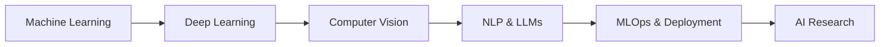

<!-- GitHub Profile Views Counter -->
<div align="center">
  
  
</div>

<!-- Animated Header -->
<div align="center">
  
</div>

<h1 align="center">
  
</h1>

<div align="center">
  
</div>

## &nbsp;***About Me***


### 🚀 **AI Engineer & Full-Stack Developer**

✨ **Passionate about transforming ideas into reality through code**  
🎯 **Specializing in AI/ML solutions and modern web development**  
🔬 **Research enthusiast in Computer Vision and NLP**  
🌟 **Always learning, always growing**

<br/>

### 📍 **Current Status**
```yaml
Name: "Hieu Vu Dinh"
Location: "Hanoi, Vietnam"
Education: "Posts and Telecommunications Institute of Technology"
Current_Work: "AI Research & Development"
Learning_Focus: ["Machine Learning", "Deep Learning", "Computer Vision", "NLP"]
Interests: ["Artificial Intelligence", "Web Development", "Open Source", "Basketball"]
Goals_2025: ["Contribute to Open Source", "Build AI Products", "Master MLOps"]
```

<br clear="both"/>

## <b> Connect with Me </b>
<div align="center">
  <a href="mailto:vhieu4344@gmail.com">
    
  </a>
  <a href="https://www.linkedin.com/in/hi%E1%BA%BFu-v%C5%A9-%C4%91%C3%ACnh-45739b284/" target="_blank">
    
  </a>
  <a href="https://www.facebook.com/profile.php?id=100021483982083" target="_blank">
    
  </a>
  <a href="https://www.instagram.com/_vdh437_/" target="_blank">
    
  </a>
  <a href="https://github.com/Hieuvu4438" target="_blank">
    
  </a>
  <a href="https://discord.gg/hieuvu4438" target="_blank">
    
  </a>
</div>

<br/>

## <b> Skills & Technologies</b>

<div align="center">
  
### 🌐 **Programming Languages**


### 🛠️ **Frameworks & Libraries**


### 💾 **Databases & Cloud**


### 🔧 **Tools & Platforms**


</div>

<br/>

## <b> GitHub Analytics</b>

<div align="center">
  <table>
    <tr>
      <td width="50%">
        
      </td>
      <td width="50%">
        
      </td>
    </tr>
    <tr>
      <td colspan="2" align="center">
        
      </td>
    </tr>
  </table>
</div>

##  <b>Activity Graph</b>

<div align="center">
  
</div>

## <b> Featured Projects Portfolio</b>

<div align="center">

### 🤖 **AI & Machine Learning Projects**

<table>
  <tr>
    <td width="50%">
      <h3 align="center">🚀 Smart Traffic Detection System</h3>
      <div align="center">  
        <a href="https://github.com/Hieuvu4438/Smart_Traffic_System" target="_blank">
          
        </a>
        <br/>
        <p><strong>Technologies:</strong> YOLOv8, OpenCV, Python, Deep Learning</p>
        <p>🎯 Real-time traffic monitoring and vehicle counting system using computer vision</p>
      </div>
    </td>
    <td width="50%">
      <h3 align="center">💬 Companion Chatbot</h3>
      <div align="center">
        <a href="https://github.com/Hieuvu4438/Companion_Chatbot" target="_blank">
          
        </a>
        <br/>
        <p><strong>Technologies:</strong> NLP, Transformers, Python, Flask</p>
        <p>🤖 AI-powered chatbot for elderly care and companionship</p>
      </div>
    </td>
  </tr>
</table>

### 🌐 **Web Development Projects**

<table>
  <tr>
    <td width="50%">
      <h3 align="center">🍕 Foody Web Application</h3>
      <div align="center">
        <a href="https://github.com/Hieuvu4438/foody_web" target="_blank">
          
        </a>
        <br/>
        <p><strong>Technologies:</strong> React, Node.js, MongoDB, Express</p>
        <p>🍔 Full-stack food delivery platform with modern UI/UX</p>
      </div>
    </td>
    <td width="50%">
      <h3 align="center">📰 Articles Website</h3>
      <div align="center">
        <a href="https://github.com/Hieuvu4438/Articles_Website_IEC" target="_blank">
          
        </a>
        <br/>
        <p><strong>Technologies:</strong> HTML5, CSS3, JavaScript, Web Scraping</p>
        <p>📖 Dynamic news aggregation and article management system</p>
      </div>
    </td>
  </tr>
</table>

### 💻 **Programming & Algorithms**

<table>
  <tr>
    <td width="33%">
      <h3 align="center">🔢 Data Structures & Algorithms</h3>
      <div align="center">
        <a href="https://github.com/Hieuvu4438/Data-Structure-and-Algorithm" target="_blank">
          
        </a>
        <p>📚 Comprehensive DSA implementation and problem solving</p>
      </div>
    </td>
    <td width="33%">
      <h3 align="center">🏆 PTIT Programming Solutions</h3>
      <div align="center">
        <a href="https://github.com/Hieuvu4438/CODE-PTIT-CPP" target="_blank">
          
        </a>
        <p>🎯 Competitive programming solutions and algorithms</p>
      </div>
    </td>
    <td width="33%">
      <h3 align="center">🐍 Python Assignments</h3>
      <div align="center">
        <a href="https://github.com/Hieuvu4438/Python-Assignment-02" target="_blank">
          
        </a>
        <p>🔬 Advanced Python programming and data analysis projects</p>
      </div>
    </td>
  </tr>
</table>

</div>

## <b> Achievements & Recognitions</b>

<div align="center">
  
### 🏆 **GitHub Trophies**


### 📊 **Contribution Statistics**


### 🐍 **Contribution Snake Animation**


</div>

##  <b>Learning Journey & Goals</b>

<div align="center">

### 🎯 **Current Learning Path**


### 📈 **2025 Goals**
- [ ] 🚀 Launch 3 AI-powered web applications
- [ ] 📚 Complete Advanced Machine Learning Specialization
- [ ] 🌟 Contribute to 10+ open source projects
- [ ] 📝 Publish research paper in AI/ML conference
- [ ] 🎓 Graduate with honors from PTIT
- [ ] 💼 Secure AI Engineer position at top tech company

</div>

##  <b>Daily Motivation</b>

<div align="center">
  
### ✨ **Inspirational Quote of the Day**


### 📊 **Coding Time This Week**
<!--START_SECTION:waka-->
<!--END_SECTION:waka-->

</div>

##  <b>Fun Facts & Interests</b>

<div align="center">

### 🎲 **Random Fun Facts**
- 🏀 Basketball enthusiast - Love playing and watching NBA
- 🎮 Gaming in spare time - Strategy and puzzle games
- 📚 Avid reader of sci-fi and technology books
- 🌱 Learning Japanese language in free time
- ☕ Coffee lover - Best ideas come with coffee!
- 🎵 Enjoy lo-fi music while coding

### 🌟 **What I'm Up To**
- 🔭 Working on **AI-powered traffic management system**
- 🌱 Learning **Advanced Deep Learning and Transformers**
- 👯 Looking to collaborate on **Open Source AI projects**
- 🤔 Seeking guidance on **MLOps and AI deployment**
- 💬 Ask me about **Python, AI/ML, Computer Vision**
- ⚡ Fun fact: **I debug better with music on! 🎧**

</div>

---

<div align="center">
  
### 💫 **Thank you for visiting my profile!**
### 📫 **Let's build something amazing together!**


**Profile Views:** 

**Last Updated:** August 2025

</div>

---

<div align="center">
  
</div>
