<!-- Dynamic Header with Waves -->
<div align="center">
  
</div>

<!-- GitHub Profile Views Counter with Enhanced Design -->
<div align="center">
  
  
  
  
</div>

<!-- Rotating AI Brain Animation -->
<div align="center">
  
  
  
</div>

<h1 align="center">
  
</h1>

<!-- Interactive Banner with AI Theme -->
<div align="center">
  
  <br/>
  
  
  
</div>

<!-- Status Badges Row -->
<div align="center">
  
  
  
</div>

## &nbsp;***About Me - The AI Explorer***

<table border="0" align="center">
<tr>
<td width="50%" valign="top">

### 🚀 **AI Engineer & Full-Stack Developer**


✨ **Passionate about transforming ideas into reality through code**  
🎯 **Specializing in AI/ML solutions and modern web development**  
🔬 **Research enthusiast in Computer Vision and NLP**  
🌟 **Always learning, always growing**  
⚡ **Building the future, one algorithm at a time**

</td>
<td width="50%" valign="top">

### 🚀 **Real-time GitHub Activity**

<!--START_SECTION:activity-->
```typescript
interface Developer {
  name: "Hieu Vu Dinh";
  role: "AI Engineer & Full-Stack Developer";
  location: "Hanoi, Vietnam 🇻🇳";
  education: "PTIT - Posts and Telecommunications Institute";
  currentFocus: ["Computer Vision", "NLP", "MLOps"];
  dailyGoals: ["Code", "Learn", "Innovate", "Repeat"];
  lifePhilosophy: "Technology should serve humanity";
}
```
<!--END_SECTION:activity-->

### 🎯 **Quick Stats**
- 🔭 Currently working on **Smart Traffic Management AI**
- 🌱 Learning **Advanced Deep Learning & MLOps**
- 👨‍🎓 Student at **PTIT University**
- 🏀 Basketball enthusiast & Tech blogger
- 💬 Ask me about **AI, Python, Computer Vision**

</td>
</tr>
</table>

## <b> Connect & Collaborate </b>

<div align="center">

<!-- Social Media Cards with Hover Effects -->
<table>
<tr>
<td align="center">
<a href="mailto:vhieu4344@gmail.com">

<br/><sub><b>Drop me a line!</b></sub>
</a>
</td>
<td align="center">
<a href="https://www.linkedin.com/in/hi%E1%BA%BFu-v%C5%A9-%C4%91%C3%ACnh-45739b284/" target="_blank">

<br/><sub><b>Let's connect professionally</b></sub>
</a>
</td>
<td align="center">
<a href="https://github.com/Hieuvu4438" target="_blank">

<br/><sub><b>Check out my repos</b></sub>
</a>
</td>
</tr>
<tr>
<td align="center">
<a href="https://www.facebook.com/profile.php?id=100021483982083" target="_blank">

<br/><sub><b>Personal updates</b></sub>
</a>
</td>
<td align="center">
<a href="https://www.instagram.com/_vdh437_/" target="_blank">

<br/><sub><b>Behind the scenes</b></sub>
</a>
</td>
<td align="center">
<a href="https://discord.gg/hieuvu4438" target="_blank">

<br/><sub><b>Tech discussions</b></sub>
</a>
</td>
</tr>
</table>

<!-- Communication Preferences -->
<details>
<summary>📞 <b>Best ways to reach me</b></summary>
<br/>

- 🚀 **For project collaborations**: LinkedIn or Email
- 💻 **For code discussions**: GitHub Issues or Discord  
- 🤝 **For casual tech talks**: Instagram or Facebook
- 📧 **For professional inquiries**: vhieu4344@gmail.com
- ⚡ **Response time**: Usually within 24 hours

</details>

</div>

## <b> Tech Arsenal & Expertise</b>

<div align="center">

<!-- Interactive Skill Showcase -->
<table>
<tr>
<td valign="top" width="33%">

### 🧠 **AI/ML Stack**
<div align="center">
<br/>


</div>

**Specializations:**
- 🎯 Computer Vision (YOLO, OpenCV)
- 🧠 Natural Language Processing
- 📊 Data Analysis & Visualization
- 🤖 Deep Learning & Neural Networks

</td>
<td valign="top" width="33%">

### 💻 **Development Stack**
<div align="center">
<br/>
<br/>


</div>

**Capabilities:**
- 🌐 Full-Stack Web Development
- 📱 Mobile App Development
- 🔄 RESTful API Design
- ⚡ Real-time Applications

</td>
<td valign="top" width="33%">

### � **Tools & Platforms**
<div align="center">
<br/>
<br/>


</div>

**Infrastructure:**
- ☁️ Cloud Deployment (AWS, GCP)
- 🐳 Containerization (Docker)
- 🔄 CI/CD Pipelines
- 📊 Monitoring & Analytics

</td>
</tr>
</table>

<!-- Programming Languages Proficiency -->
### � **Programming Languages & Databases**
<div align="center">

<br/><br/>

</div>

<!-- Skill Level Indicators -->
### 📈 **Proficiency Levels**
```
🐍 Python          ████████████████████ 100%  Expert
💻 C++             ██████████████████   90%   Advanced  
🌐 JavaScript      █████████████████    85%   Advanced
🤖 TensorFlow      ████████████████     80%   Advanced
⚛️  React          ███████████████      75%   Intermediate+
🎯 Computer Vision ████████████████████ 95%   Expert
📊 Data Science    ██████████████████   90%   Advanced
☁️  Cloud/DevOps   ████████████         60%   Intermediate
```

</div>

<br/>

## <b> GitHub Analytics Dashboard</b>

<div align="center">

<!-- Enhanced Stats Layout -->
<table>
  <tr>
    <td width="50%">
      
    </td>
    <td width="50%">
      
    </td>
  </tr>
  <tr>
    <td width="50%">
      
    </td>
    <td width="50%">
      
    </td>
  </tr>
</table>

<!-- Detailed Analytics -->
<details>
<summary>🔍 <b>Detailed GitHub Analytics</b></summary>
<br/>

### 📈 **Contribution Timeline**


### ⏰ **Commit Activity Patterns**


### 📊 **Repository Statistics**


</details>

<!-- Live Coding Stats -->
### ⚡ **Real-time Development Metrics**
<!--START_SECTION:waka-->
```text
🌟 Total Lines of Code: 50,000+
🔥 Current Streak: Building AI solutions daily
⭐ Projects Completed: 15+ repositories
🚀 Focus Areas: Computer Vision, NLP, Web Development
```
<!--END_SECTION:waka-->

</div>

##  <b>Activity Graph</b>

<div align="center">
  
</div>

## <b> Featured Projects Showcase</b>

<div align="center">

### 🎯 **Project Categories**


---

### 🏆 **Flagship AI & Machine Learning Projects**

<table>
  <tr>
    <td width="50%">
      <div align="center">
        <h3>🚀 Smart Traffic Detection System</h3>
        <a href="https://github.com/Hieuvu4438/Smart_Traffic_System" target="_blank">
          
        </a>
        <br/>
        <details>
        <summary><b>🔍 Project Details</b></summary>
        <br/>
        <p><strong>🛠 Tech Stack:</strong> YOLOv8, OpenCV, Python, TensorFlow, Flask</p>
        <p><strong>🎯 Features:</strong></p>
        <ul align="left">
          <li>Real-time vehicle detection & counting</li>
          <li>Traffic flow analysis</li>
          <li>License plate recognition</li>
          <li>Web dashboard for monitoring</li>
        </ul>
        <p><strong>📊 Impact:</strong> 95% accuracy in vehicle detection</p>
        
        
        </details>
      </div>
    </td>
    <td width="50%">
      <div align="center">
        <h3>🤖 AI Companion Chatbot</h3>
        <a href="https://github.com/Hieuvu4438/Companion_Chatbot" target="_blank">
          
        </a>
        <br/>
        <details>
        <summary><b>🔍 Project Details</b></summary>
        <br/>
        <p><strong>🛠 Tech Stack:</strong> Transformers, NLTK, PyTorch, Flask, React</p>
        <p><strong>🎯 Features:</strong></p>
        <ul align="left">
          <li>Natural conversation flow</li>
          <li>Emotional support capabilities</li>
          <li>Health monitoring reminders</li>
          <li>Multi-language support</li>
        </ul>
        <p><strong>📊 Impact:</strong> Helping elderly stay connected</p>
        
        
        </details>
      </div>
    </td>
  </tr>
</table>

---

### 🌐 **Full-Stack Web Applications**

<table>
  <tr>
    <td width="50%">
      <div align="center">
        <h3>🍕 Foody - Food Delivery Platform</h3>
        <a href="https://github.com/Hieuvu4438/foody_web" target="_blank">
          
        </a>
        <br/>
        <p><strong>🚀 Full MERN Stack</strong> | <strong>📱 Responsive Design</strong> | <strong>💳 Payment Integration</strong></p>
        
      </div>
    </td>
    <td width="50%">
      <div align="center">
        <h3>📰 NewsHub - Articles Platform</h3>
        <a href="https://github.com/Hieuvu4438/Articles_Website_IEC" target="_blank">
          
        </a>
        <br/>
        <p><strong>🔍 Web Scraping</strong> | <strong>📊 Analytics</strong> | <strong>🎨 Modern UI</strong></p>
        
      </div>
    </td>
  </tr>
</table>

---

### 💻 **Algorithms & Programming Excellence**

<table>
  <tr>
    <td width="33%">
      <div align="center">
        <h4>🔢 Data Structures & Algorithms</h4>
        <a href="https://github.com/Hieuvu4438/Data-Structure-and-Algorithm" target="_blank">
          
        </a>
        <p><strong>📚 500+ Problems Solved</strong></p>
        
      </div>
    </td>
    <td width="33%">
      <div align="center">
        <h4>🏆 Competitive Programming</h4>
        <a href="https://github.com/Hieuvu4438/CODE-PTIT-CPP" target="_blank">
          
        </a>
        <p><strong>🎯 Contest Solutions</strong></p>
        
      </div>
    </td>
    <td width="33%">
      <div align="center">
        <h4>🐍 Python Mastery</h4>
        <a href="https://github.com/Hieuvu4438/Python-Assignment-02" target="_blank">
          
        </a>
        <p><strong>🔬 Advanced Projects</strong></p>
        
      </div>
    </td>
  </tr>
</table>

---

### 🚀 **Latest Releases & Updates**
<div align="center">


<!-- Recent Commits -->
<details>
<summary>📝 <b>Recent Activity Highlights</b></summary>
<br/>

```diff
+ 🔥 Added AI-powered recommendation engine to Foody platform
+ 🚀 Optimized traffic detection model - 15% speed improvement  
+ 🌟 Implemented real-time chat feature in companion chatbot
+ 📊 Enhanced data visualization dashboard with D3.js
+ 🛠 Refactored codebase for better maintainability
```

</details>

</div>

</div>

## <b> Achievements & Recognitions</b>

<div align="center">
  
### 🏆 **GitHub Trophies**


### 📊 **Contribution Statistics**


### 🐍 **Contribution Snake Animation**


</div>

##  <b>Learning Journey & Future Roadmap</b>

<div align="center">

### 🎯 **Current Learning Trajectory**

```mermaid
graph TD
    A[🎓 Computer Science Fundamentals] --> B[🐍 Python Mastery]
    B --> C[🤖 Machine Learning]
    C --> D[🧠 Deep Learning]
    D --> E[👁️ Computer Vision]
    E --> F[🗣️ Natural Language Processing]
    F --> G[☁️ MLOps & Cloud Deployment]
    G --> H[🔬 AI Research & Innovation]
    
    style A fill:#ff6b6b
    style B fill:#4ecdc4
    style C fill:#45b7d1
    style D fill:#96ceb4
    style E fill:#ffeaa7
    style F fill:#dda0dd
    style G fill:#ff7675
    style H fill:#a29bfe
```


### � **Learning Progress Dashboard**
<table>
<tr>
<td width="50%">

#### 🔥 **Currently Mastering**
```python
current_focus = {
    "primary": [
        "🧠 Advanced Deep Learning Architectures",
        "🚀 MLOps & Model Deployment", 
        "📊 Computer Vision Research",
        "🌐 Scalable Web Applications"
    ],
    "secondary": [
        "☁️ Cloud Architecture (AWS/GCP)",
        "🔄 DevOps & CI/CD Pipelines",
        "📱 Mobile Development (Flutter)",
        "🌍 Open Source Contributions"
    ]
}
```

</td>
<td width="50%">

#### 🎯 **2025 Milestone Goals**
- [ ] � **Complete Google AI/ML Professional Certificate**
- [ ] 📝 **Publish 2 research papers in AI conferences**
- [ ] 🚀 **Launch 3 production-ready AI applications**
- [ ] 🌟 **Achieve 1000+ GitHub stars across projects**
- [ ] 🤝 **Mentor 10+ junior developers**
- [ ] 💼 **Secure AI Engineer role at top tech company**
- [ ] 🎓 **Graduate with First Class Honors from PTIT**

</td>
</tr>
</table>

### 📈 **Learning Statistics**
<div align="center">


</div>

<!-- Learning Resources -->
<details>
<summary>📚 <b>Favorite Learning Resources & Tools</b></summary>
<br/>

### 🎓 **Online Platforms**
- **Coursera**: Deep Learning Specialization, Google AI Certificates
- **edX**: MIT Computer Science courses
- **Kaggle**: Data Science competitions and datasets
- **Udacity**: AI/ML Nanodegrees
- **YouTube**: 3Blue1Brown, Two Minute Papers, Sentdex

### 📖 **Essential Books**
- "Hands-On Machine Learning" by Aurélien Géron
- "Deep Learning" by Ian Goodfellow
- "Python Machine Learning" by Sebastian Raschka
- "Computer Vision: Algorithms and Applications" by Richard Szeliski

### 🛠 **Development Tools**
- **IDEs**: VS Code, PyCharm, Jupyter Lab
- **Version Control**: Git, GitHub, GitLab
- **Cloud**: Google Colab, AWS SageMaker, Paperspace
- **Deployment**: Docker, Kubernetes, Heroku, Vercel

</details>

</div>

##  <b>Daily Motivation</b>

<div align="center">
  
### ✨ **Inspirational Quote of the Day**


### 📊 **Coding Time This Week**
<!--START_SECTION:waka-->
<!--END_SECTION:waka-->

</div>

##  <b>Beyond Code: Personal Insights</b>

<div align="center">

### 🎲 **The Human Behind the Code**
<table>
<tr>
<td width="33%" valign="top">

#### 🏀 **Sports & Fitness**


- **Basketball Enthusiast** 🏀
  - Lakers fan since 2010
  - Regular pickup games
  - Believes in Mamba Mentality in coding
- **Morning Runner** 🏃‍♂️
  - 5K daily routine
  - Best debugging happens while running

</td>
<td width="33%" valign="top">

#### 🎵 **Creative Pursuits**


- **Music & Productivity** �
  - Lo-fi hip hop for coding sessions
  - Classical music for deep thinking
  - Spotify playlist: "Code & Flow"
- **Photography** 📸
  - Street photography hobbyist
  - Captures tech events & nature

</td>
<td width="33%" valign="top">

#### 📚 **Intellectual Growth**


- **Reading Habits** 📖
  - Sci-fi novels (Isaac Asimov fan)
  - Tech biographies & philosophy
  - Japanese language learning
- **Gaming** 🎮
  - Strategy games (Chess, StarCraft)
  - Problem-solving puzzle games

</td>
</tr>
</table>

### ☕ **Coding Philosophy & Principles**
<blockquote>
<h4>"Code is poetry written for machines to understand and humans to admire."</h4>
</blockquote>

```python
my_coding_principles = {
    "clean_code": "Write code as if the person maintaining it is a violent psychopath who knows where you live",
    "continuous_learning": "The day you stop learning is the day you become obsolete",
    "problem_solving": "Every bug is an opportunity to understand the system better",
    "collaboration": "Great software is built by great teams, not great individuals",
    "innovation": "Technology should solve real-world problems and make life better"
}

life_motto = "Debug your code, debug your life. Both require patience, logic, and coffee ☕"
```

### 🌟 **Random Fun Facts About Me**
<div align="center">

| 🎯 **Fact** | 📝 **Details** |
|:---:|:---|
| ☕ **Coffee Consumption** | 4-5 cups per day (Colombian blend preferred) |
| 🔥 **Longest Coding Session** | 18 hours straight (debugging a neural network) |
| 🌍 **Languages** | Vietnamese (native), English (fluent), Japanese (learning) |
| 🎵 **Coding Playlist** | 200+ songs, mostly lo-fi and ambient electronic |
| � **Basketball Position** | Point Guard (loves strategy and playmaking) |
| 📱 **Phone OS** | Android (loves customization and flexibility) |
| 🕒 **Peak Productivity** | 9 PM - 2 AM (night owl programmer) |
| 🍕 **Favorite Coding Snack** | Vietnamese coffee + dark chocolate |

</div>

### 💭 **Current Mood & Status**
<div align="center">

```ascii
    ╔══════════════════════════════════════╗
    ║  🧠 Currently thinking about:        ║
    ║  • Transformer architectures         ║
    ║  • Computer vision optimization      ║
    ║  • Next breakthrough in AI           ║
    ║                                      ║
    ║  🎵 Currently listening to:          ║
    ║  "Weightless" by Marconi Union       ║
    ║                                      ║
    ║  📚 Currently reading:               ║
    ║  "The Singularity is Near" - Ray K. ║
    ║                                      ║
    ║  💻 Currently coding:                ║
    ║  AI-powered traffic optimization     ║
    ╚══════════════════════════════════════╝
```

**Debug Mode**: 🟢 **Active** | **Coffee Level**: ☕☕☕⚪ | **Inspiration**: 📈 **High**

</div>

### 🎯 **What Drives Me**
<div align="center">

> *"I believe AI has the potential to solve humanity's greatest challenges. Every line of code I write is a step toward a future where technology serves everyone, not just a few. My goal isn't just to build AI systems, but to build AI systems that make the world a better place."*


</div>

</div>

---

<div align="center">

## 🌟 **Thank You for Visiting My Digital Universe!** 🌟


### � **"The best way to predict the future is to invent it"** - Alan Kay

<table>
<tr>
<td align="center">

<br/><sub><b>Always Learning</b></sub>
</td>
<td align="center">

<br/><sub><b>Always Building</b></sub>
</td>
<td align="center">

<br/><sub><b>Always Innovating</b></sub>
</td>
</tr>
</table>

### 🚀 **Ready to Collaborate?**
<div align="center">
<a href="mailto:vhieu4344@gmail.com">

</a>
</div>

### 📊 **Visitor Analytics**


**Last Updated:** August 2025 | **Made with** ❤️ **and lots of** ☕

### 🔗 **Quick Links**
[🏠 Portfolio](https://github.com/Hieuvu4438) • [📧 Email](mailto:vhieu4344@gmail.com) • [💼 LinkedIn](https://linkedin.com/in/hi%E1%BA%BFu-v%C5%A9-%C4%91%C3%ACnh-45739b284) • [📱 Contact](https://github.com/Hieuvu4438)

</div>

---

<!-- Animated Footer -->
<div align="center">
  
</div>

<!-- Easter Egg -->
<!-- 
████████╗██╗  ██╗ █████╗ ███╗   ██╗██╗  ██╗    ██╗   ██╗ ██████╗ ██╗   ██╗
╚══██╔══╝██║  ██║██╔══██╗████╗  ██║██║ ██╔╝    ╚██╗ ██╔╝██╔═══██╗██║   ██║
   ██║   ███████║███████║██╔██╗ ██║█████╔╝      ╚████╔╝ ██║   ██║██║   ██║
   ██║   ██╔══██║██╔══██║██║╚██╗██║██╔═██╗       ╚██╔╝  ██║   ██║██║   ██║
   ██║   ██║  ██║██║  ██║██║ ╚████║██║  ██╗       ██║   ╚██████╔╝╚██████╔╝
   ╚═╝   ╚═╝  ╚═╝╚═╝  ╚═╝╚═╝  ╚═══╝╚═╝  ╚═╝       ╚═╝    ╚═════╝  ╚═════╝ 
   
   for exploring my profile! If you found something interesting, 
   don't forget to ⭐ star my repositories and 🤝 connect with me!
-->
